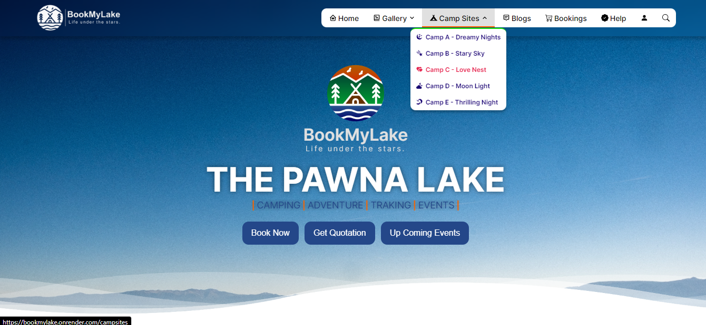
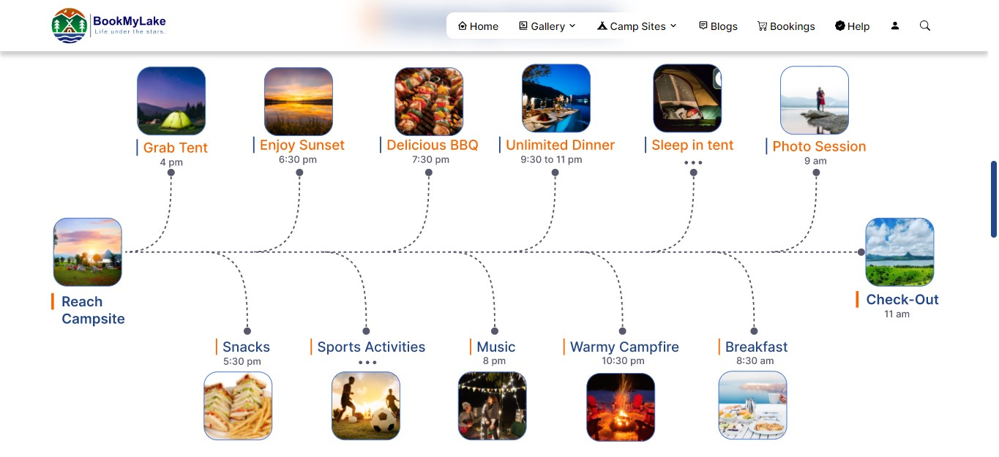
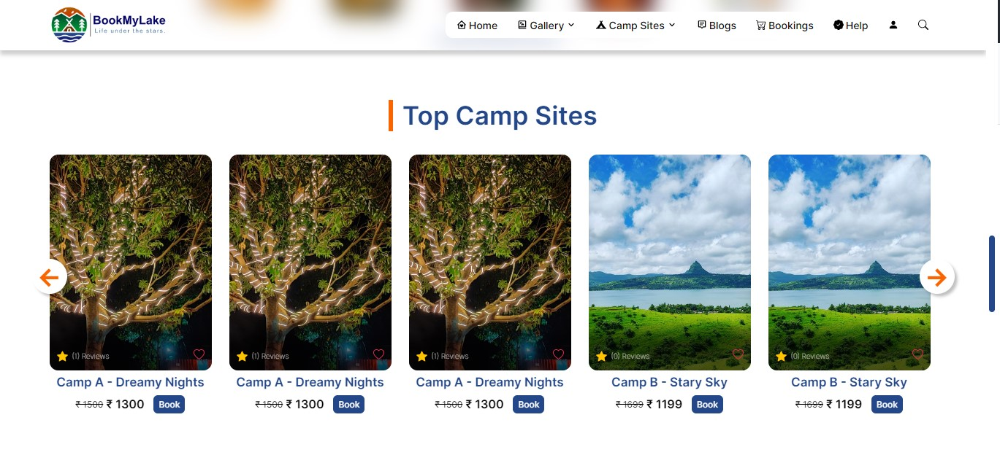
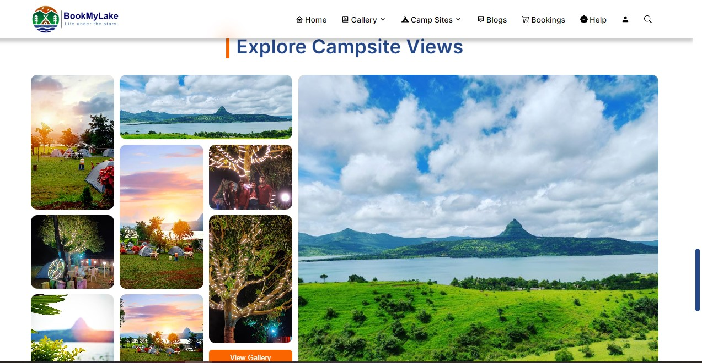
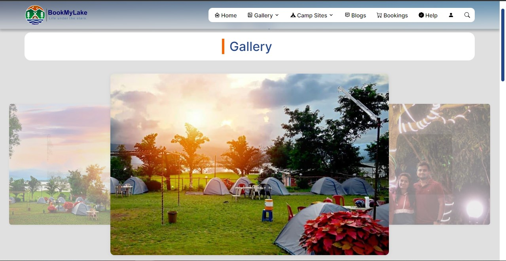
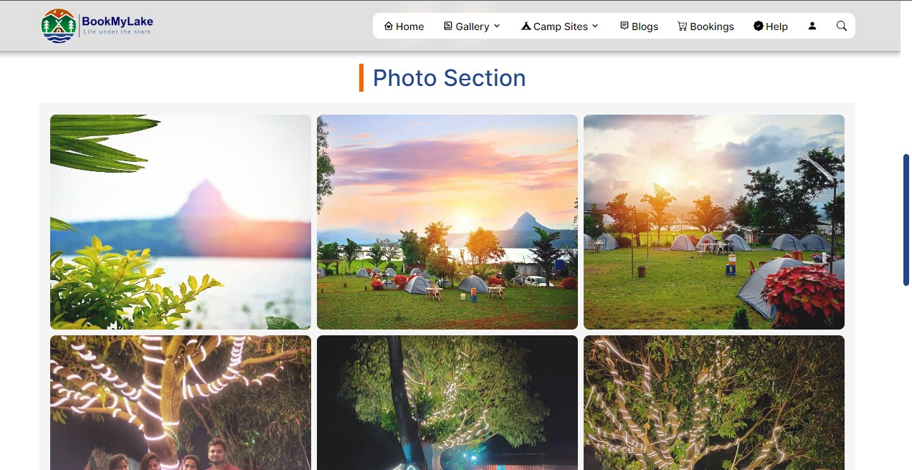
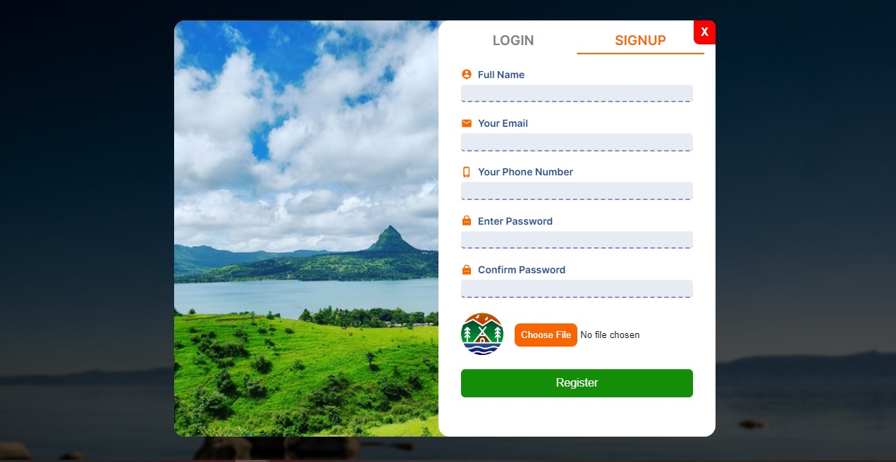
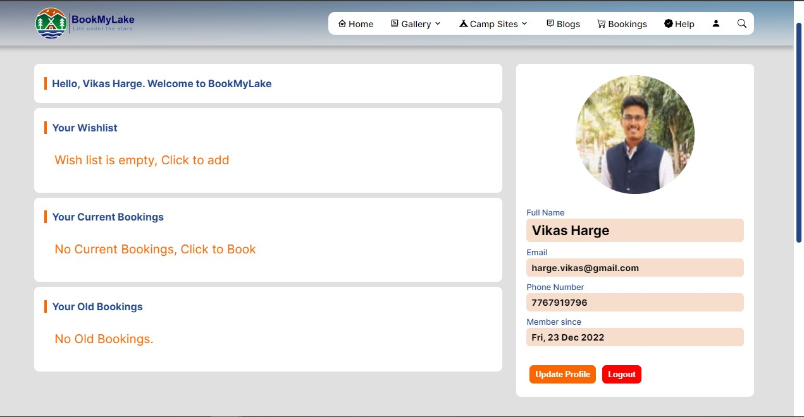

<!-- PROJECT LOGO -->
 

  <a href="https://bookmylake.onrender.com" target="_blank" >
    
       
     
  </a>

  <h4 align="center">Explore the camping adventure with <strong>BookMyLake</strong></h4>
  

     
    <a href="https://github.com/VikasHarge/BookMyLake-FrontEnd"><strong>Explore the docs »</strong></a>
     
    <a href="https://bookmylake.onrender.com" target="_blank" >View Demo</a>
    ·
    <a href="https://github.com/VikasHarge/BookMyLake-BackEnd">View Backend Repo</a>
  

## Pawnalake Campsite Booking Website

[Visit Website](https://bookmylake.onrender.com)

This is a full-stack web application for booking campsites at pawnalake in lonavala, pune. Users can search for available campsites accross diferrent categories such as Family camping, corporate camping, group camping, couple camping, make reservations, and leave reviews. The application is built using React for the frontend, Node.js for the backend, and MongoDB for the database.

## Table of Contents

- [Project Description](#project-description)
- [Live Demo](https://bookmylake.onrender.com/)
- [Technologies Used](#technologies-used)
- [Installation](#installation)
- [Usage](#usage)
- [Contributing](#contributing)
- [License](#license)

## Project Description

Near Lonavala in Pune there is a popular lake called pawna lake which has 100+ camping sites that provide a relaxing lake-side camping experience, but the problem is the majority of them are operating offline. this makes visitors very difficult to search for and chose the best lake-side campsite for their holidays. 

Therefore I am building bookmylake.com which will provide campsite owners to bring their service online and will help tourists to search, compare, and choose the perfect camping experience. 

This platform connects tourists with a wide variety of campsites and camping options, from rustic tent sites to luxurious camping accommodations.

Booking a camping trip has never been easier. Simply create an account, browse through our selection of campsites, and book the one that fits the user's schedule

The project was built as part of a full-stack web development course, with a focus on using modern tools and best practices.

### Features

The Lake Side Camp Booking Website allows users to:

- Search for available campsites at pawna lake.
- See photos and videos of campsite.
- Make reservations for campsites they are interested in.
- Leave reviews for campsites they have stayed at.
- Create user account to Manage their reservations and reviews

### Preview

  
   
  
  
  
  
  
  
  
  
  
  

## Technologies Used
* 
* 
* 
* 
* 
* 
* 
* 

### Libraries Used
* 
* 
* 
* 
* 
* 

## Installation

To run this project locally, follow these steps:

1. Clone the repository: `git clone https://github.com/VikasHarge/BookMyLake-FrontEnd`
2. Install dependencies: `npm install`
3. Start the server: `npm start`
4. Open the application in your browser: `http://localhost:3000`
5. For sample user login Userid : harge.vikas@gmail.com, Password : Vikas@123

## Usage

Once the application is running, you can use it to search for campsites, make reservations, and leave reviews. You can also view your reservations and reviews by logging into your account.

## License

This project is licensed under the terms of the [MIT](https://opensource.org/licenses/MIT) license.

## Reach Me

